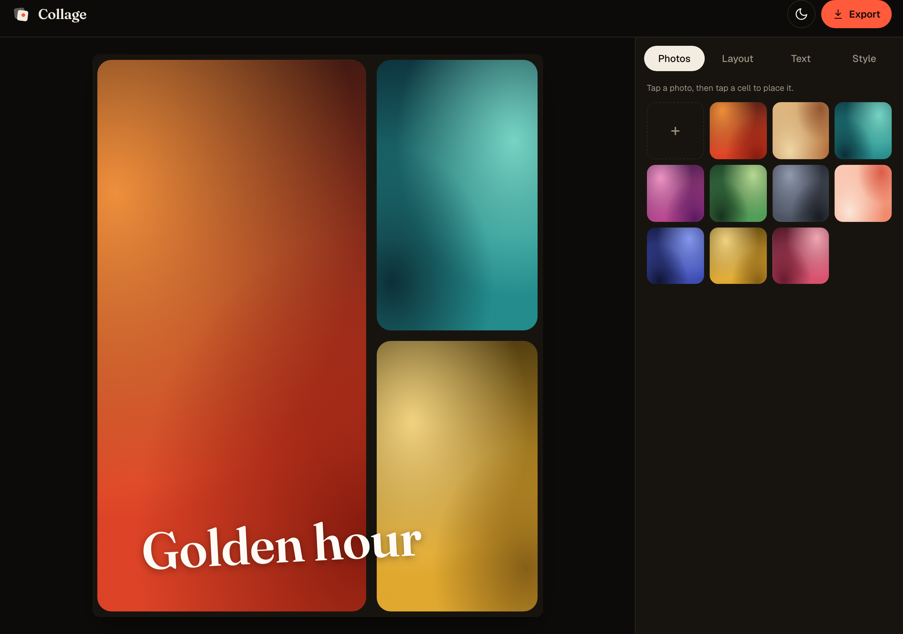
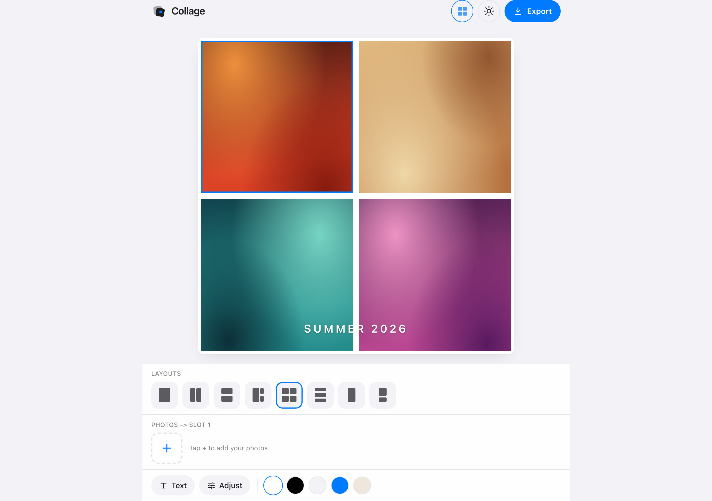
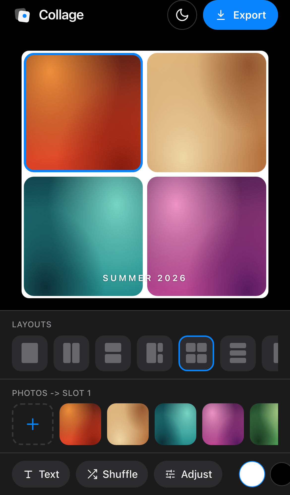
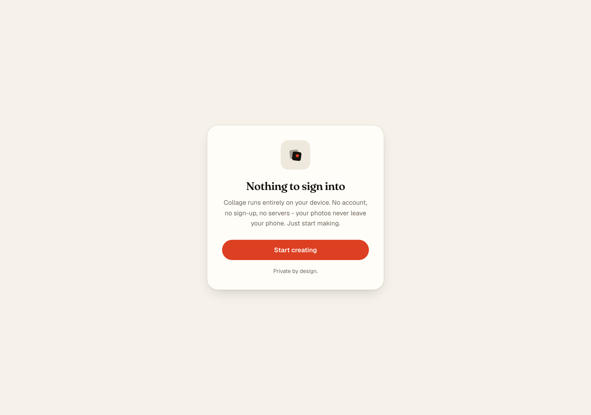
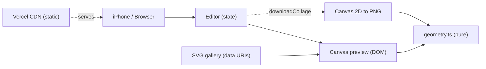

<div align="center">


# Collage

**Make it. Caption it. Ship it.**

A fast, private, mobile-first collage maker. Drop in photos, snap them into a
layout, lay nice text over the top, and export a crisp PNG - all in the browser.
Nothing ever leaves your device.

[](https://nextjs.org)
[](https://react.dev)
[](https://www.typescriptlang.org)
[](https://tailwindcss.com)
[](https://playwright.dev)
[](https://collage-bheng.vercel.app)
[](LICENSE)

[**Open the app -> collage-bheng.vercel.app**](https://collage-bheng.vercel.app)



</div>

---

## Why Collage

Most collage tools ask you to sign up, upload your photos to their servers, and
wait. Collage does none of that. It is a single-page app: your photos are read
straight into the browser, composed on a canvas, and rendered to a high-res PNG
locally. No account, no backend, no tracking - and because it is all static, it
scales to a CDN edge with zero infrastructure.

## Features

- **Fewest clicks** - tap **Select photos**, pick 4 for a 4-up (they fill the
  slots in order), tap **Export**. Tap any tile to swap that photo straight from
  your camera roll.
- **Clean, phone-first** - nothing on screen but your collage; tools reveal their
  controls only when tapped. No always-on menus.
- **Filters** - swipe across any photo to flick through Warm, Cold, Dream, Dark,
  B&W, Noir, Sepia, HDR and Fade. Applied identically in the preview and export.
- **Stickers** - tap in emoji stickers, then drag, resize and spin them.
- **Text** - captions with font (sans/serif/mono/round), color, and top/middle/
  bottom placement.
- **Saves to Photos** - on a phone, Save opens the share sheet so "Save Image"
  drops it straight into your camera roll (desktop downloads a PNG).
- **Instant** - system fonts (SF on iPhone), no web-font downloads, static SSG -
  it paints immediately.
- **Photos in, PNG out** - pick from the built-in gallery or upload your own from
  your camera roll. Everything is processed on-device.
- **8 layouts** - single, side-by-side, stacked, feature, quad, thirds, story and
  story-split, covering square, portrait and 9:16 formats.
- **Nice text, instantly** - 4 tuned presets (Headline, Caption, Sticker,
  Signature) that already look designed. Drag to place, recolor, resize, rotate.
- **Style controls** - spacing, corner radius and 5 canvas backgrounds.
- **Light & dark** - respects your system theme with a no-flash manual toggle.
- **Mobile-first** - built for the iPhone: bottom-sheet tools, safe-area aware,
  touch-native drag and place.
- **Installable (PWA)** - add to home screen and it opens full-screen.
- **Crisp export** - a 2160px-long-edge PNG rendered on a real `<canvas>`, so the
  preview and the file share one geometry.

## Screenshots

| Light | Mobile | Sign-in |
| --- | --- | --- |
|  |  |  |

## Architecture

The whole editor is fractional: every cell and every text overlay is a `{x, y, w, h}`
in the unit square, so the on-screen preview and the exported PNG are computed from
identical numbers. The shared math lives in one pure, tested module used by both the
DOM renderer and the canvas exporter, so the preview can never drift from the file.



| Module | Role |
| --- | --- |
| `src/lib/geometry.ts` | Pure fit / cover math (unit-tested) |
| `src/lib/layouts.ts` | Layout templates, backgrounds, text presets |
| `src/lib/gallery.ts` | Self-contained SVG data-URI starter art |
| `src/lib/export.ts` | Canvas 2D to PNG renderer (WYSIWYG) |
| `src/components/Editor.tsx` | State owner + orchestration |
| `src/components/Canvas.tsx` | Fractional preview stage |
| `src/components/Tray.tsx` | Photos / Layout / Text / Style tools |

The gallery art is generated as SVG data URIs, which keeps the bundle tiny, needs no
image licensing, and never taints the export canvas.

## Design decisions

| Decision | Chosen | Alternative | Why |
| --- | --- | --- | --- |
| Storage | Fully client-side | Accounts + DB | Private, free to host, infinitely scalable |
| Export | Hand-rolled canvas 2D | `html-to-image` dep | One less dependency, exact geometry control |
| Gallery | Inline SVG data URIs | Bundled bitmaps | No licensing, no requests, no canvas taint |
| Geometry | One fractional model | Separate preview/export math | Preview and PNG can never disagree |

## Project layout

```
src/
  app/            # routes: editor (/), sign-in (/signin), manifest, layout
  components/     # Editor, Canvas, Tray, ThemeToggle, Mark
  lib/            # geometry, layouts, gallery, export, types (+ *.test.ts)
e2e/              # Playwright specs (desktop + iPhone)
scripts/          # asset + screenshot generation
public/           # icons, OG image, favicon
docs/             # README screenshots
```

## Configuration

No environment variables required. Clone, install, run.

## Run locally

```bash
npm install
npm run dev          # http://localhost:3000
```

### Scripts

| Command | What it does |
| --- | --- |
| `npm run dev` | Start the dev server |
| `npm run build` | Production build |
| `npm run test` | Unit tests (Vitest) |
| `npm run test:e2e` | End-to-end tests (Playwright, desktop + iPhone) |
| `npm run typecheck` | `tsc --noEmit` |
| `npm run lint` | ESLint |
| `npm run gen:assets` | Regenerate icons / OG image from source |

## Tech stack

Next.js 16 (App Router, static) · React 19 · TypeScript · Tailwind CSS v4 ·
Canvas 2D export · Vitest · Playwright · Vercel.

No database, no auth, no server state - by design.

## License

[MIT](LICENSE) © Bunlong Heng
